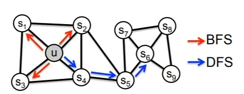

## A Survey on Knowledge Graphs: Representation, Acquisition, and Applications

- **Published**: IEEE Transactions on Neural Networks and Learning Systems, 2021
- **Link**: [IEEE Xplore](https://ieeexplore.ieee.org/document/9446554)
- **Summary**: A comprehensive review of knowledge graph representation learning, acquisition methods, and applications.

## I. INTRODUCTION

- Incorporating human knowledge in AI is essential for solving complex tasks.
- Knowledge graphs represent structured facts and are gaining research attention.
- Knowledge graphs consist of entities, relationships, and semantic descriptions.
- They can be viewed as graphs or knowledge bases for interpretation and inference.
- Examples include factual triples and graph representations of entities and relationships.

### Contributions

- Comprehensive review of knowledge graph origins and modern techniques.
- Full-view categorization of knowledge graph research and new taxonomies.
- Wide coverage on emerging advances like transformer-based encoding and GNNs.
- Summary and outlook on future research directions.

## II. OVERVIEW

### A. A Brief History of Knowledge Bases

- Knowledge representation dates back to the 1950s with semantic nets and symbolic logic.
- Early systems like MYCIN used rule-based expert systems for problem-solving.
- The Cyc project aimed at assembling human knowledge.
- Semantic Web standards like RDF and OWL were developed.
- Google's Knowledge Graph popularized the concept in 2012.

### B. Definitions and Notations

- No wide-accepted formal definition of knowledge graphs exists.
- Ehrlinger and Wöß define knowledge graphs with reasoning engines.
- Wang et al. define them as multi-relational graphs of entities and relations.
- Notations include sets of entities, relations, and facts, with various mathematical operations.

### C. Categorization of Research on Knowledge Graph

- Knowledge representation learning (KRL) involves learning low-dimensional embeddings.
- Knowledge acquisition includes tasks like knowledge graph completion and relation extraction.
- Temporal knowledge graphs incorporate temporal information for representation.
- Knowledge-aware applications use knowledge graphs in areas like NLU and recommendation systems.

## III. KNOWLEDGE REPRESENTATION LEARNING

### A. Representation Space

- Entities and relations are embedded in various spaces like Euclidean, complex vector, Gaussian distribution, and manifold.
- Point-wise space is widely used, but other spaces capture different properties.
- Complex space allows for symmetric and antisymmetric relations.
- Manifold space offers more expressive representation.

| Representation Space     | Description | Advantages | Disadvantages |
|--------------------------|-------------|------------|---------------|
| **Euclidean Space**      | Entities and relations are represented as vectors in a continuous space. | - Simple and intuitive. - Well-understood mathematical properties. | - Limited expressiveness for complex structures. |
| **Complex Vector Space** | Uses complex numbers to represent entities and relations, capturing symmetric and antisymmetric relations. | - Handles symmetric and antisymmetric relations effectively. | - Increased computational complexity. |
| **Gaussian Distribution**| Models entities and relations with Gaussian distributions to account for uncertainties. | - Captures uncertainty and variance in data. - Provides probabilistic interpretation. | - Computationally intensive. - Requires modeling covariance. |
| **Manifold Space**       | Embeddings lie on complex topological spaces like spheres or hyperplanes. | - Highly expressive for complex and hierarchical data. - Captures non-Euclidean structures effectively. | - Increased mathematical and computational complexity.  - More challenging to implement and optimize. |

### B. Scoring Function

- Measures the plausibility of facts in knowledge graphs.
- Distance-based functions calculate distances between entities.
- Semantic similarity functions measure plausibility through matching.
- Translational models like TransE use distance-based scoring.

### C. Encoding Models

- Linear/bilinear models use linear operations for encoding interactions.
- Factorization models decompose relational data into low-rank matrices.
- Neural networks, CNNs, RNNs, and transformers encode relational interactions.
- Graph neural networks (GNNs) learn connectivity structures in graphs.

### D. Embedding with Auxiliary Information

- Textual descriptions provide supplementary semantic information.
- Type information incorporates hierarchical classes of entities.
- Visual information uses images to enrich embeddings.
- Uncertain information represents the likelihood of relational facts.

### E. Summary

- KRL involves choosing representation space, scoring function, encoding model, and auxiliary information.
- Popular spaces include Euclidean, complex, Gaussian, and manifold.
- Scoring functions can be distance-based or similarity-based.
- Encoding models vary from linear/bilinear to advanced neural networks and GNNs.

## IV. KNOWLEDGE ACQUISITION

### A. Knowledge Graph Completion (KGC)

- Expands existing knowledge graphs with new facts.
- Methods:
  - Embedding-based ranking,
    - valid triples (head, relation, tail) are closer in the embedding space than invalid ones
    - Scoring functions are used to measure the plausibility of triples.
  - path-based reasoning,
    - This method explores the paths between entities to infer new relationships.
    - The paths provide contextual information that can improve link prediction.
  - RL-based Path Finding
  - rule-based reasoning
    - using logical rules to infer new facts
    - e.g. (Y, sonOf, X) ← (X, hasChild, Y) ∧ (Y, gender, Male)
  - Meta Relational Learning
- Triple classification and entity discovery tasks are included.

### B. Entity Discovery

- Entity Discovery
  - This section distinguishes entity-based knowledge acquisition into several tasks: entity recognition, entity disambiguation, entity typing, and entity alignment. These tasks are collectively termed as entity discovery as they all explore entity-related knowledge under different settings.
  
  - Entity Recognition
    - Also known as named entity recognition (NER).
    - Task: Tags entities in text.
    - Methods: Hand-crafted features (capitalization patterns, gazetteers).
    - Recent Work: Sequence-to-sequence neural architectures like LSTM-CNN.
    - Example: LSTM-CRF, MGNER, multi-task training for multi-token and single-token entities.
    - Advanced Techniques: Pretrained language models with knowledge graphs (ERNIE, K-BERT).

  - Entity Typing
    - Types: Coarse and fine-grained types.
    - Fine-grained types use a tree-structured category, seen as multi-class and multi-label classification.
    - Challenges: Reducing label noise and managing growing typesets.
    - Methods: PLE with partial-label embedding, prototype-driven label embedding.
    - Example: JOIE for joint embeddings, ConnectE for local and global triple knowledge.

  - Entity Disambiguation
    - Also known as entity linking.
    - Task: Links entity mentions to corresponding entities in a knowledge graph.
    - Example: Linking "Einstein" to Albert Einstein.
    - Techniques: Representation learning of entities and mentions.
    - Example Models: DSRM for entity semantic relatedness, EDKate for joint embedding of entity and text.
    - Advanced Techniques: Attentive neural models over local context windows, differentiable message passing.

  - Entity Alignment
    - Task: Fuse knowledge among various knowledge graphs.
    - Goal: Find an alignment set
       $A = \{(e1, e2) \in E1 \times E2 | e1 \equiv e2 \}$
    - Methods: Embedding-based alignment, iterative alignment.
    - Example: MTransE for multilingual scenarios, IPTransE for joint embedding, BootEA for bootstrapping approach.
    - Additional Techniques: JAPE for cross-lingual attributes, KDCoE for multi-lingual entity descriptions, MultiKE for multiple views of entity name, relation, and attributes.
    - Example: Incorporating additional information of entities for refinement.

### C. Relation Extraction

- Relation Extraction
  - Key task for building large-scale knowledge graphs by extracting relational facts from text.
  - Uses distant supervision to create training data by heuristic matching.

  - Neural Relation Extraction
    - Uses CNNs, RNNs for relation classification and extraction.
    - Example: PCNN applies piecewise max pooling, SDP-LSTM uses multi-channel LSTM.

  - Attention Mechanism
    - Combines attention mechanisms with CNNs and RNNs.
    - Example: APCNN uses entity descriptions, Att-BLSTM uses word-level attention with BiLSTM.

  - Graph Convolutional Networks (GCNs)
    - Encodes dependency trees or learns KGEs for sentence encoding.
    - Example: C-GCN uses contextualized GCN, AGGCN applies multi-head attention.

  - Adversarial Training
    - Adds adversarial noise to word embeddings.
    - Example: DSGAN denoises distantly supervised relation extraction.

  - Reinforcement Learning
    - Trains instance selectors with policy networks.
    - Example: Qin et al. use F1 score-based rewards, HRL proposes hierarchical policy learning.

  - Other Advances
    - Includes deep residual learning, transfer learning, and trustworthy relation extraction.
    - Example: Huang and Wang use deep residual learning, CORD combines text corpus and KG with logical rules.

  - Joint Entity and Relation Extraction
    - Combines entity mention extraction and relation classification.
    - Example: Attention-based LSTM network by Katiyar and Cardie, cascade binary tagging by Wei et al.

## V. TEMPORAL KNOWLEDGE GRAPHS

### A. Temporal Embedding

- Incorporates time information in embeddings.
- Techniques capture temporal dynamics of entities and relations.

### B. Entity Dynamics

- Models changes in entity attributes and relationships over time.
- Focuses on capturing temporal dependencies.

### C. Temporal Relational Dependency

- Explores how relations evolve over time.
- Models temporal logical reasoning and dependencies.

## VI. KNOWLEDGE-AWARE APPLICATIONS

### A. Natural Language Understanding (NLU)

- Uses knowledge graphs to enhance language understanding.
- Applications include question answering and dialogue systems.

### B. Recommender Systems

- Improves recommendations by integrating knowledge graphs.
- Addresses sparse and cold start problems.

### C. Miscellaneous Real-World Applications

- Applications in search engines, medical domains, mental healthcare, and more.
- Enhances tasks like zero-shot image classification and sentiment analysis.

## VII. FUTURE WORK

- Exploration of complex reasoning using GNNs and reinforcement learning.
- Development of unified frameworks for knowledge representation and reasoning.
- Emphasis on interpretability and scalability of KGE methods.
- Integration of dynamic and temporal aspects in knowledge graphs.

## VIII. CONCLUSION

- Knowledge graphs are vital for advancing AI with structured information.
- Significant progress has been made, but challenges remain in reasoning and scalability.
- Future research should address these challenges for full potential utilization.

### Reference

- Shaoxiong Ji, Pekka Marttinen, Shirui Pan, Erik Cambria, Philip S. Yu, "A Survey on Knowledge Graphs: Representation, Acquisition, and Applications", IEEE Transactions on Neural Networks and Learning Systems, 2021.

## Notes

- Key Concepts
  - Quick recap of entities, relationships, and triples
  - Ontologies and schemas

- Construction of Knowledge Graphs
  - Data Collection and Preprocessing
  - Entity Recognition and Linking
  - Triples Extraction
  - Integration and Fusion
  - Storage Solutions (Graph databases, RDF stores)

- Advanced Techniques
  - Using Machine Learning for Entity Recognition and Relationship Extraction
  - Probabilistic Knowledge Graphs
  - Incorporating NLP for enhanced extraction and linking

- Tools and Technologies
  - popular tools: Neo4j
  - Brief demos or screenshots

- Use Cases and Applications
  - Real-world examples in various domains (healthcare, finance, e-commerce)
  - Enhancing recommendation systems, semantic search, and data integration

- Challenges and Solutions
  - Scalability
  - Data Quality and Integration
  - Maintaining and Updating Graphs

## TransE paper

- Overview
  - The TransE model represents entities and relationships in a continuous vector space. The core idea is that if a triple $(h, r, t)$ holds true, then the embedding of the head entity $\mathbf{h}$ plus the embedding of the relation $\mathbf{r}$ should be close to the embedding of the tail entity $\mathbf{t}$. The TransE loss function is designed to enforce this principle by minimizing the distance between $\mathbf{h} + \mathbf{r}$ and $\mathbf{t}$ for valid triples, while ensuring that invalid triples have a larger distance.

- Loss Function
  - The loss function in TransE uses a margin-based ranking criterion. This function includes both positive and negative examples to ensure the model distinguishes between correct and incorrect triples.
  - The loss function can be formulated as:
    
     $L = \sum_{(h, r, t) \in \mathcal{S}} \sum_{(h', r, t') \in \mathcal{S'}} \left[ \gamma + d(\mathbf{h} + \mathbf{r}, \mathbf{t}) - d(\mathbf{h'} + \mathbf{r}, \mathbf{t'}) \right]_{+}$

  - $\mathcal{S}$ is the set of positive (valid) triples.

  - $\mathcal{S'}$ is the set of negative (invalid) triples generated by corrupting $ \mathcal{S} $.
  - $\gamma$ is the margin, a hyperparameter that defines the minimum distance between positive and negative triples.
  - $d(\cdot)$ is the distance function (either L1 or L2 norm).

  - $[ \cdot ]_{+}$ denotes the positive part, meaning $\max(0, x)$.

- Intuition
  - Positive Triples: The loss function minimizes the distance $d(\mathbf{h} + \mathbf{r}, \mathbf{t})$ for valid triples, making sure that $\mathbf{h} + \mathbf{r} \approx \mathbf{t}$.
  - Negative Triples: For corrupted triples, the distance $d(\mathbf{h'} + \mathbf{r}, \mathbf{t'})$ should be as large as possible, ensuring that $\mathbf{h'} + \mathbf{r}$ is not close to $\mathbf{t'}$.
  - By minimizing this loss function, the model learns embeddings such that valid triples are closer together in the embedding space compared to invalid triples.

- Summary
  - The TransE loss function uses a margin-based ranking criterion to ensure that valid triples have smaller distances compared to invalid ones.
  - The intuitive goal is to make valid triples close in the embedding space while pushing invalid triples apart.
  - The margin $\gamma$ controls the separation between positive and negative triples, and the distance metric can be either L1 or L2 norm.
  - This method helps in effectively training the embeddings to distinguish between valid and invalid relationships in a knowledge graph.

### Implementations

```python
import torch
import torch.nn as nn
import torch.optim as optim

class TransE(nn.Module):
    def __init__(self, num_entities, num_relations, embedding_dim, margin=1.0, norm=1):
        super(TransE, self).__init__()
        self.entity_embeddings = nn.Embedding(num_entities, embedding_dim)
        self.relation_embeddings = nn.Embedding(num_relations, embedding_dim)
        self.margin = margin
        self.norm = norm  # 1 for L1 norm, 2 for L2 norm

        # Initialize embeddings randomly.
        nn.init.xavier_uniform_(self.entity_embeddings.weight.data)
        nn.init.xavier_uniform_(self.relation_embeddings.weight.data)

    def forward(self, h, r, t):
        h_embedded = self.entity_embeddings(h)
        r_embedded = self.relation_embeddings(r)
        t_embedded = self.entity_embeddings(t)
        return h_embedded, r_embedded, t_embedded

    def loss(self, pos_triples, neg_triples):
        pos_h, pos_r, pos_t = pos_triples
        neg_h, neg_r, neg_t = neg_triples

        pos_h_embedded, pos_r_embedded, pos_t_embedded = self.forward(pos_h, pos_r, pos_t)
        neg_h_embedded, neg_r_embedded, neg_t_embedded = self.forward(neg_h, neg_r, neg_t)

        pos_distance = torch.norm(pos_h_embedded + pos_r_embedded - pos_t_embedded, p=self.norm, dim=1)
        neg_distance = torch.norm(neg_h_embedded + neg_r_embedded - neg_t_embedded, p=self.norm, dim=1)

        loss = torch.sum(torch.relu(self.margin + pos_distance - neg_distance))
        return loss

# Example usage
num_entities = 4  # Alice, Bob, Charlie, David
num_relations = 2  # friendOf, colleagueOf
embedding_dim = 7
margin = 1.0
model = TransE(num_entities, num_relations, embedding_dim, margin)

# Optimizer
optimizer = optim.Adam(model.parameters(), lr=0.001)

# Example positive and negative triples
pos_triples = (
    torch.tensor([0, 1, 2]),  # Head entities: Alice, Bob, Charlie
    torch.tensor([0, 0, 1]),  # Relations: friendOf, friendOf, colleagueOf
    torch.tensor([1, 2, 3])   # Tail entities: Bob, Charlie, David
)

neg_triples = (
    torch.tensor([0, 1, 2]),  # Head entities: Alice, Bob, Charlie
    torch.tensor([0, 0, 1]),  # Relations: friendOf, friendOf, colleagueOf
    torch.tensor([2, 3, 0])   # Tail entities: Charlie, David, Alice (randomly corrupted)
)

# Print the initial embeddings before training
initial_entity_embeddings = model.entity_embeddings.weight.data.clone()
initial_relation_embeddings = model.relation_embeddings.weight.data.clone()

print("Initial Entity Embeddings:")
print(initial_entity_embeddings)

print("Initial Relation Embeddings:")
print(initial_relation_embeddings)

# Training loop
epochs = 200
for epoch in range(epochs):
    model.train()
    optimizer.zero_grad()
    loss = model.loss(pos_triples, neg_triples)
    loss.backward()
    optimizer.step()
    if (epoch + 1) % 30 == 0:
        print(f'Epoch {epoch+1}, Loss: {loss.item()}')

# Accessing the entity and relation embeddings after training
final_entity_embeddings = model.entity_embeddings.weight.data
final_relation_embeddings = model.relation_embeddings.weight.data

print("\nFinal Entity Embeddings:")
# print(final_entity_embeddings)

print("\nFinal Relation Embeddings:")
# print(final_relation_embeddings)

# Example inference: get the embedding for a specific entity and relation
entity_idx = 0  # Example entity index
relation_idx = 0  # Example relation index

initial_entity_embedding = initial_entity_embeddings[entity_idx]
initial_relation_embedding = initial_relation_embeddings[relation_idx]
final_entity_embedding = final_entity_embeddings[entity_idx]
final_relation_embedding = final_relation_embeddings[relation_idx]

print(f'\nInitial Embedding for entity {entity_idx}: {initial_entity_embedding}')
print(f'Initial Embedding for relation {relation_idx}: {initial_relation_embedding}')
print(f'Final Embedding for entity {entity_idx}: {final_entity_embedding}')
print(f'Final Embedding for relation {relation_idx}: {final_relation_embedding}')


```

Ouptut:

```text
Initial Entity Embeddings:
tensor([[ 0.3136, -0.1941, -0.1631, -0.2950,  0.3734,  0.0123, -0.3953],
        [-0.2188, -0.2769, -0.5799, -0.2892, -0.2250,  0.7215, -0.4351],
        [-0.0712,  0.1976, -0.2865, -0.2884,  0.0214, -0.3816, -0.0810],
        [ 0.2617, -0.6003,  0.7249,  0.6405, -0.6770,  0.1776, -0.4784]])
Initial Relation Embeddings:
tensor([[ 0.3823,  0.7712, -0.7779, -0.7209, -0.3273, -0.7017,  0.2453],
        [-0.0923,  0.2648,  0.0189, -0.6642, -0.0149,  0.1680, -0.6854]])
Epoch 30, Loss: 5.484335899353027
Epoch 60, Loss: 4.4643402099609375
Epoch 90, Loss: 3.444344997406006
Epoch 120, Loss: 2.511836290359497
Epoch 150, Loss: 1.6007781028747559
Epoch 180, Loss: 0.713299036026001

Final Entity Embeddings:

Final Relation Embeddings:

Initial Embedding for entity 0: tensor([ 0.3136, -0.1941, -0.1631, -0.2950,  0.3734,  0.0123, -0.3953])
Initial Embedding for relation 0: tensor([ 0.3823,  0.7712, -0.7779, -0.7209, -0.3273, -0.7017,  0.2453])
Final Embedding for entity 0: tensor([ 0.5136, -0.3941,  0.0318, -0.0950,  0.5734,  0.2123, -0.4633])
Final Embedding for relation 0: tensor([ 0.3823,  0.7712, -0.7981, -0.7209, -0.3273, -0.7017,  0.1057])
```

## more notes

- Triplets validation

  - Triple Validation: Validate new facts or check the consistency of existing facts in the knowledge graph. For example, to validate `(Alice, friendOf, Bob)`, the model would score this triple. If the score is high, the fact is considered valid.

  - Triple Completion: Predict missing entities in a query. For example, given `(Alice, friendOf, ?)`, the model can score different entities to find the most likely friend of Alice.

- Edge prediction using Ampligraph:  <https://docs.ampligraph.org/en/latest/index.html>

   

- paper review: <https://www.youtube.com/watch?v=kfDufTaMsZ4>

- demo  neo4j <https://youtu.be/LlNy5VmV290?si=dH0vRDWX-Mb4IyJe>

- TransE: <https://medium.com/stanford-cs224w/knowledge-graph-embeddings-simplistic-and-powerful-representations-ed43a1a73c7c>

- DFS/BFS for context of the node. Used in Random Walk approach.
- 

- recent work: Graph RAG using LLMs
