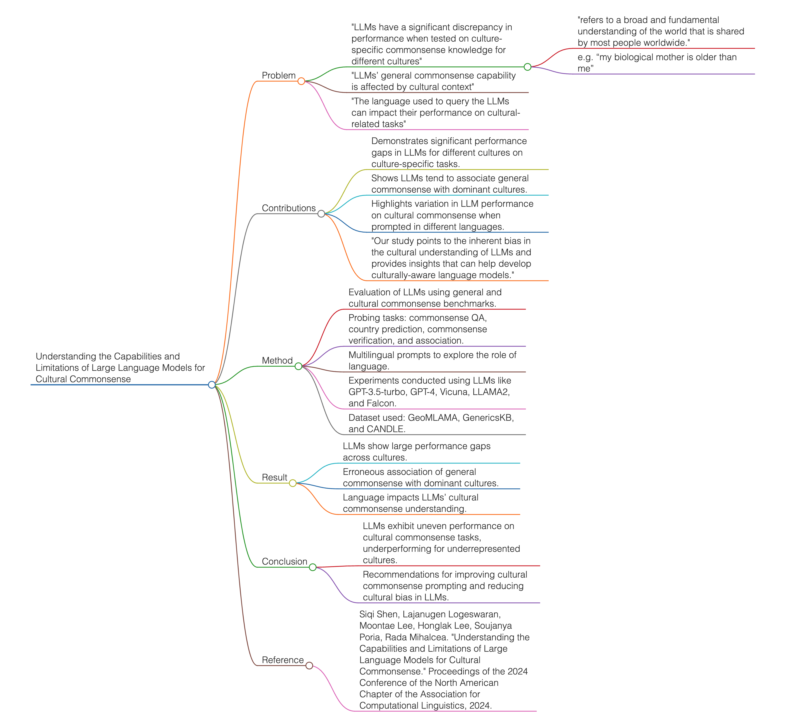

# Understanding the Capabilities and Limitations of Large Language Models for Cultural Commonsense
- **Published**: Proceedings of the 2024 Conference of the North American Chapter of the Association for Computational Linguistics
- **Link**: https://aclanthology.org/2024.naacl-long.316/?s=09
- **Summary**: This paper examines the capabilities and limitations of large language models (LLMs) in understanding cultural commonsense.

### Problem

- "LLMs have a significant discrepancy in performance when tested on culture-specific commonsense knowledge for different cultures"
  - "refers to a broad and fundamental understanding of the world that is shared by most people worldwide."
  - e.g. “my biological mother is older than me”
- "LLMs’ general commonsense capability is affected by cultural context"
- "The language used to query the LLMs can impact their performance on cultural-related tasks"

### Contributions

- Demonstrates significant performance gaps in LLMs for different cultures on culture-specific tasks.
- Shows LLMs tend to associate general commonsense with dominant cultures.
- Highlights variation in LLM performance on cultural commonsense when prompted in different languages.
- "Our study points to the inherent bias in the cultural understanding of LLMs and provides insights that can help develop culturally-aware language models."

### Method

- Evaluation of LLMs using general and cultural commonsense benchmarks.
- Probing tasks: commonsense QA, country prediction, commonsense verification, and association.
- Multilingual prompts to explore the role of language.
- Experiments conducted using LLMs like GPT-3.5-turbo, GPT-4, Vicuna, LLAMA2, and Falcon.
- Dataset used: GeoMLAMA, GenericsKB, and CANDLE.

### Result

- LLMs show large performance gaps across cultures.
- Erroneous association of general commonsense with dominant cultures.
- Language impacts LLMs’ cultural commonsense understanding.

### Conclusion

- LLMs exhibit uneven performance on cultural commonsense tasks, underperforming for underrepresented cultures.
- Recommendations for improving cultural commonsense prompting and reducing cultural bias in LLMs.

### Reference

- Siqi Shen, Lajanugen Logeswaran, Moontae Lee, Honglak Lee, Soujanya Poria, Rada Mihalcea. "Understanding the Capabilities and Limitations of Large Language Models for Cultural Commonsense." Proceedings of the 2024 Conference of the North American Chapter of the Association for Computational Linguistics, 2024.

