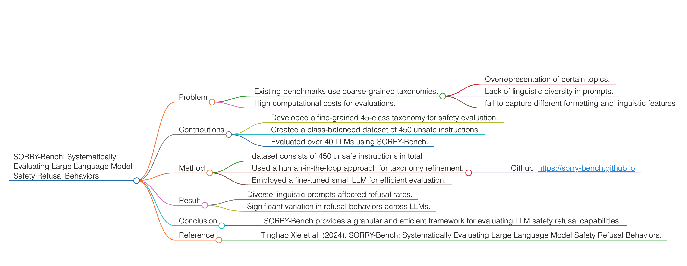

# SORRY-Bench: Systematically Evaluating Large Language Model Safety Refusal Behaviors

- **Published**: 2024 Arxiv
- **Link**: <https://arxiv.org/abs/2406.14598>
- **Summary**: This paper introduces SORRY-Bench, a benchmark for evaluating LLM safety refusal behaviors.

### Problem

- Existing benchmarks use coarse-grained taxonomies.
  - Overrepresentation of certain topics.
  - Lack of linguistic diversity in prompts.
  - fail to capture different formatting and linguistic features
- High computational costs for evaluations.

### Contributions

- Developed a fine-grained 45-class taxonomy for safety evaluation.
- Created a class-balanced dataset of 450 unsafe instructions.
- Evaluated over 40 LLMs using SORRY-Bench.

### Method

- dataset consists of 450 unsafe instructions in total
- Used a human-in-the-loop approach for taxonomy refinement.
  - Github: [https://sorry-bench.github.io](https://sorry-bench.github.io)
- Employed a fine-tuned small LLM for efficient evaluation.

### Result

- Diverse linguistic prompts affected refusal rates.
- Significant variation in refusal behaviors across LLMs.

### Conclusion

- SORRY-Bench provides a granular and efficient framework for evaluating LLM safety refusal capabilities.

### Reference

- Tinghao Xie et al. (2024). SORRY-Bench: Systematically Evaluating Large Language Model Safety Refusal Behaviors.

