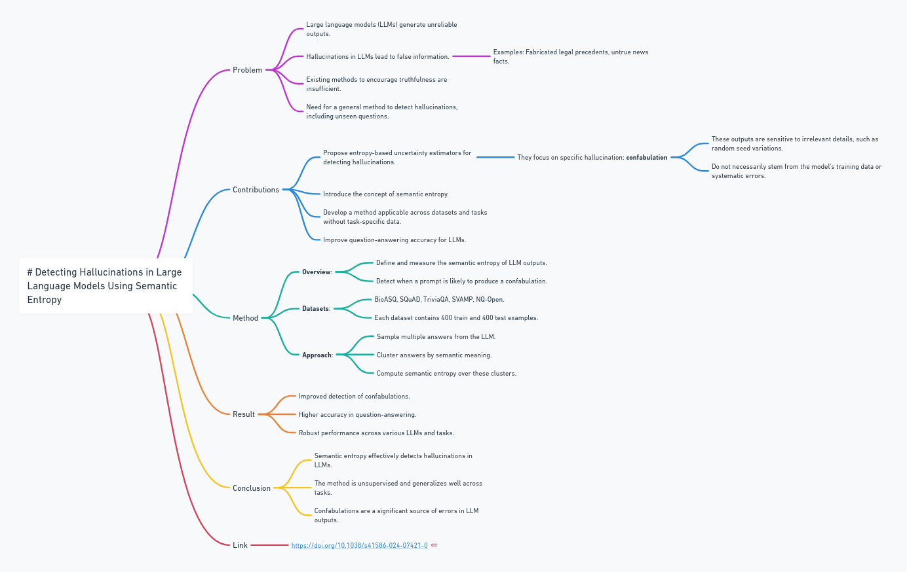

# Detecting Hallucinations in Large Language Models Using Semantic Entropy
- **Published**: Nature, 2024
- **Link**: [URL to the paper](https://doi.org/10.1038/s41586-024-07421-0)
- **Summary**: This paper proposes a method to detect hallucinations in large language models using semantic entropy.

### Problem
- Large language models (LLMs) generate unreliable outputs.
- Hallucinations in LLMs lead to false information.
  - Examples: Fabricated legal precedents, untrue news facts.
- Existing methods to encourage truthfulness are insufficient.
- Need for a general method to detect hallucinations, including unseen questions.

### Contributions
- Propose entropy-based uncertainty estimators for detecting hallucinations.
  - They focsu on specific hallucination: **confabulation**
    - These outputs are sensitive to irrelevant details, such as random seed variations,
    - and do not necessarily stem from the model's training data or systematic errors.
- Introduce the concept of semantic entropy.
- Develop a method applicable across datasets and tasks without task-specific data.
- Improve question-answering accuracy for LLMs.

### Method
- **Overview**:
  - Define and measure the semantic entropy of LLM outputs.
  - Detect when a prompt is likely to produce a confabulation.
- **Datasets**:
  - BioASQ, SQuAD, TriviaQA, SVAMP, NQ-Open.
  - Each dataset contains 400 train and 400 test examples.
- **Approach**:
  - Sample multiple answers from the LLM.
  - Cluster answers by semantic meaning.
  - Compute semantic entropy over these clusters.

### Result
- Improved detection of confabulations.
- Higher accuracy in question-answering.
- Robust performance across various LLMs and tasks.

### Conclusion
- Semantic entropy effectively detects hallucinations in LLMs.
- The method is unsupervised and generalizes well across tasks.
- Confabulations are a significant source of errors in LLM outputs.

### Reference
- Farquhar, S., Kossen, J., Kuhn, L., & Gal, Y. (2024). Detecting Hallucinations in Large Language Models Using Semantic Entropy. Nature, 630, 625-630. [https://doi.org/10.1038/s41586-024-07421-0](https://doi.org/10.1038/s41586-024-07421-0).

